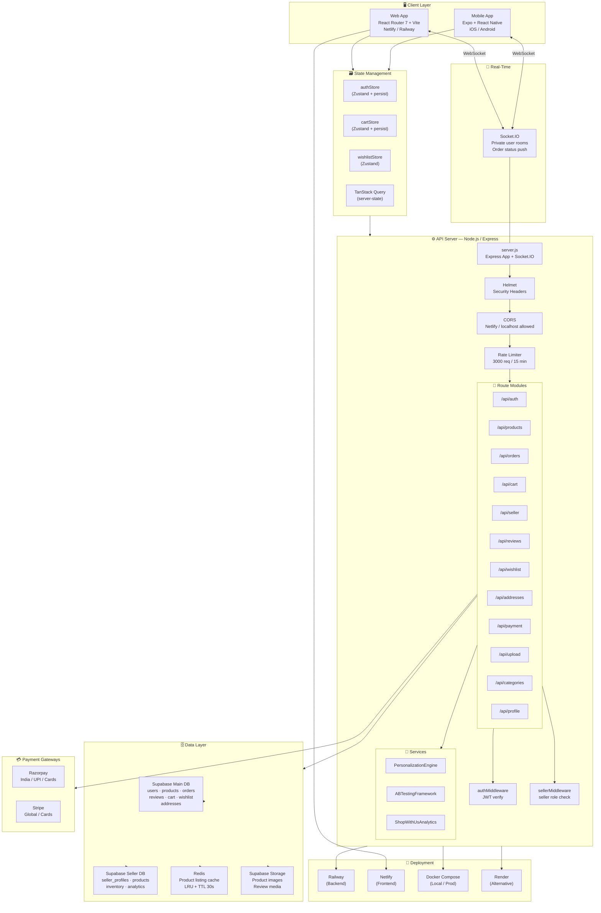
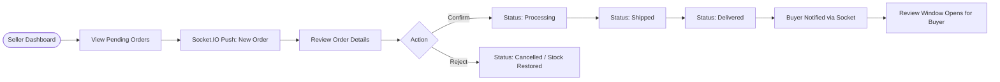
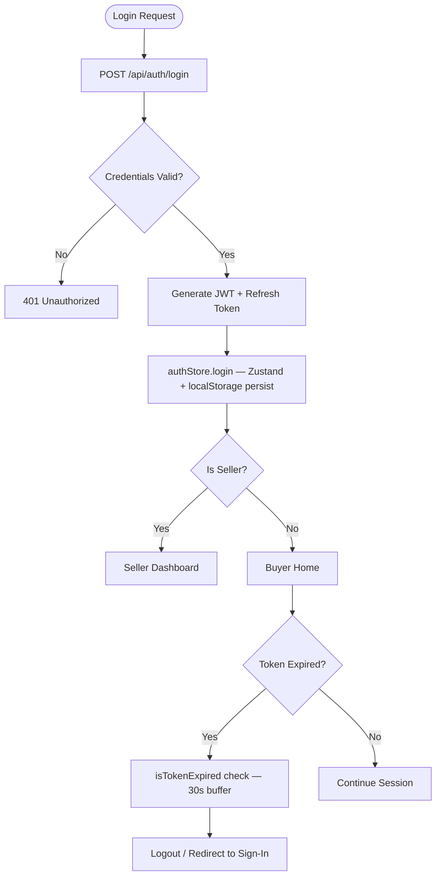

<div align="center">

# 🌟 Serendipity

### *"Finding something good without looking for it"*

**A production-grade, full-stack multi-platform e-commerce platform — Web + Mobile — built with modern JavaScript, Supabase PostgreSQL, real-time sockets, and dual-payment gateways.**

[](https://nodejs.org/)
[](https://react.dev/)
[](https://expo.dev/)
[](https://supabase.com/)
[](https://www.typescriptlang.org/)
[](https://tailwindcss.com/)
[](https://socket.io/)
[](https://docker.com/)
[](./LICENSE)

[Live Demo](https://serendipity-frontend-v1.netlify.app) · [API Docs](./docs/API_DOCUMENTATION.md) · [Deployment Guide](./docs/DEPLOYMENT.md) · [Environment Setup](./docs/ENV_SETUP.md)

</div>

---

## 📑 Table of Contents

1. [Project Overview](#-project-overview)
2. [High-Level Architecture](#-high-level-architecture)
3. [System Layers](#-system-layers)
4. [Detailed Architecture Diagram](#-detailed-architecture-diagram)
5. [Application Flow Nodes](#-application-flow-nodes)
6. [Tech Stack](#-tech-stack)
7. [Tech Category Breakdown](#-tech-category-breakdown)
8. [Language Breakdown](#-language-breakdown)
9. [Repository Structure](#-repository-structure)
10. [Key Features](#-key-features)
11. [API Reference Summary](#-api-reference-summary)
12. [Database Schema Overview](#-database-schema-overview)
13. [Real-Time & Event System](#-real-time--event-system)
14. [Payment Architecture](#-payment-architecture)
15. [Deployment Topology](#-deployment-topology)
16. [Stack Proficiency](#-stack-proficiency)
17. [Project Health Score](#-project-health-score)
18. [Insights & Engineering Notes](#-insights--engineering-notes)
19. [Getting Started](#-getting-started)
20. [Post-MVP Roadmap](#-post-mvp-roadmap)

---

## 🔭 Project Overview

**Serendipity** is a full-featured, multi-role marketplace application that supports three types of users — **Buyers**, **Sellers**, and **Admins** — across two client surfaces: a **React web application** and a **React Native (Expo) mobile app**, both sharing a single **Node.js/Express REST API**.

The platform covers the complete e-commerce lifecycle:

| Capability | Description |
|---|---|
| 🛍️ Product Discovery | Category browsing, keyword search, price/rating filters, personalised recommendations |
| 🛒 Cart & Checkout | Persistent cart (local + server sync), multi-step checkout, address management |
| 💳 Payments | Razorpay (India / UPI) and Stripe (global cards) with webhook support |
| 📦 Order Management | Real-time order status timeline, buyer cancellation, seller fulfilment |
| 🏪 Seller Dashboard | Inventory CRUD, bulk CSV upload, analytics, per-order notifications |
| 👤 Buyer Profile | Activity dashboard, order history, address book, payment methods, wishlist |
| ⭐ Reviews | Star ratings, text reviews, media uploads (photos/video) |
| 🔔 Real-Time Notifications | Socket.IO private rooms per user, live order status push |
| 📊 Admin Panel | Sales charts, user management, platform analytics |
| 🔐 Auth | JWT-based authentication, refresh tokens, Supabase Auth integration |

---

## 🏛️ High-Level Architecture

```
┌─────────────────────────────────────────────────────────────────────────────┐
│                            CLIENT LAYER                                      │
│                                                                              │
│   ┌─────────────────────────────┐     ┌──────────────────────────────────┐  │
│   │   Web App (React Router 7)  │     │  Mobile App (Expo / React Native) │  │
│   │   Netlify / Railway CDN     │     │  iOS · Android · Expo Go          │  │
│   └────────────┬────────────────┘     └────────────────┬─────────────────┘  │
└────────────────┼────────────────────────────────────────┼────────────────────┘
                 │  REST + WebSocket (Socket.IO)           │  REST + WebSocket
                 ▼                                         ▼
┌─────────────────────────────────────────────────────────────────────────────┐
│                           API / SERVER LAYER                                 │
│                                                                              │
│   ┌─────────────────────────────────────────────────────────────────────┐   │
│   │           Node.js 18 + Express 4   (server.js)                      │   │
│   │                                                                      │   │
│   │  Helmet · CORS · Rate-Limit · Compression · Body-Parser             │   │
│   │  JWT Auth Middleware · Seller Middleware · Error Middleware          │   │
│   │                                                                      │   │
│   │  /api/auth    /api/products   /api/orders    /api/cart              │   │
│   │  /api/seller  /api/reviews    /api/wishlist  /api/addresses         │   │
│   │  /api/payment /api/upload     /api/categories /api/profile          │   │
│   │                                                                      │   │
│   │  Socket.IO Server (Private Rooms per userId)                        │   │
│   └───────────┬───────────────────────────────────────────┬─────────────┘   │
└───────────────┼───────────────────────────────────────────┼─────────────────┘
                │                                           │
     ┌──────────▼──────────┐                   ┌───────────▼───────────┐
     │  Supabase (Main DB)  │                   │ Supabase (Seller DB)  │
     │  PostgreSQL          │                   │  PostgreSQL           │
     │  users, products,    │                   │  seller_profiles,     │
     │  orders, cart,       │                   │  products, analytics  │
     │  reviews, wishlist,  │                   │                       │
     │  addresses           │                   │                       │
     └──────────┬──────────┘                   └───────────────────────┘
                │
     ┌──────────▼──────────┐
     │     Redis Cache      │
     │  (LRU + TTL)         │
     │  Product listings,   │
     │  Category sets       │
     └─────────────────────┘
```

---

## 🗂️ System Layers

```
┌──────────────────────────────────────────────────────────────────────┐
│  LAYER 6 — PRESENTATION                                              │
│  React 18 (Web) · React Native / Expo (Mobile)                       │
│  TailwindCSS · Framer Motion · Radix UI · Shadcn/ui · Three.js       │
├──────────────────────────────────────────────────────────────────────┤
│  LAYER 5 — STATE & DATA FETCHING                                     │
│  Zustand (auth, cart, wishlist stores)                                │
│  TanStack Query v5 (server-state, caching)                           │
│  React Hook Form + Yup (form state & validation)                     │
├──────────────────────────────────────────────────────────────────────┤
│  LAYER 4 — ROUTING & SERVER-RENDERING                                │
│  React Router v7 (file-system routes, SSR-ready)                     │
│  Expo Router v6 (file-system routes, native + web)                   │
├──────────────────────────────────────────────────────────────────────┤
│  LAYER 3 — API & BUSINESS LOGIC                                      │
│  Node.js 18 + Express 4                                              │
│  Route Modules · Middleware Chain · Services · Utils                 │
│  Personalization Engine · A/B Testing Framework · Analytics          │
├──────────────────────────────────────────────────────────────────────┤
│  LAYER 2 — INTEGRATION & REAL-TIME                                   │
│  Supabase JS SDK (@supabase/supabase-js)                             │
│  Socket.IO 4 (bidirectional, private rooms)                          │
│  Razorpay SDK · Stripe SDK · Multer (file uploads)                   │
├──────────────────────────────────────────────────────────────────────┤
│  LAYER 1 — DATA & INFRASTRUCTURE                                     │
│  Supabase (Main DB — buyers/orders/reviews)                          │
│  Supabase (Seller DB — seller profiles/inventory)                    │
│  Redis (response caching, TTL-based invalidation)                    │
│  Supabase Storage (product images, review media)                     │
├──────────────────────────────────────────────────────────────────────┤
│  LAYER 0 — DEPLOYMENT & OPS                                          │
│  Docker + Docker Compose (local + prod)                              │
│  Railway (backend, Nixpacks builder)                                 │
│  Netlify (frontend, React Router adapter)                            │
│  Render (alternative, Docker-based)                                  │
└──────────────────────────────────────────────────────────────────────┘
```

---

## 📐 Detailed Architecture Diagram



---

## 🔄 Application Flow Nodes

### Buyer Purchase Flow

```mermaid
flowchart LR
    A([User Visits App]) --> B{Authenticated?}
    B -- No --> C[Browse Products / Categories]
    C --> D[Click Product]
    D --> E[Product Detail Page]
    E --> F{Add to Cart?}
    F -- Yes --> G[Redirect to Sign In]
    G --> H[Login / Register]
    H --> I[Cart Restored from Server]
    B -- Yes --> J[Home / Personalised Feed]
    J --> K[Search or Browse]
    K --> E
    I --> L[Cart Page]
    F -- Already Logged In --> L
    L --> M[Checkout Step 1: Address]
    M --> N[Checkout Step 2: Payment Method]
    N --> O{Payment Method}
    O -- COD --> P[Place Order]
    O -- Razorpay --> Q[Razorpay Modal] --> P
    O -- Stripe --> R[Stripe Checkout Session] --> P
    P --> S[Order Created in Supabase]
    S --> T[Real-Time Notification → Seller]
    S --> U[Order Success Page]
    U --> V[Order Tracking / Status Timeline]
```



### Seller Order Fulfilment Flow



### Authentication Flow



---

## 🛠️ Tech Stack

### Backend

| Technology | Version | Role |
|---|---|---|
| **Node.js** | ≥18.0.0 | Runtime |
| **Express** | 4.22 | HTTP framework |
| **Socket.IO** | 4.8 | Real-time bidirectional events |
| **@supabase/supabase-js** | 2.93 | Supabase PostgreSQL client |
| **pg** | 8.17 | Raw PostgreSQL driver |
| **Redis** (`redis` v4) | 4.7 | Response caching |
| **Razorpay** | 2.9 | Indian payment gateway |
| **Stripe** (via frontend) | 18.x | Global payment gateway |
| **Helmet** | 8.1 | HTTP security headers |
| **express-rate-limit** | 8.2 | API rate limiting |
| **Multer** | 2.0 | File/image upload |
| **compression** | 1.8 | Gzip response compression |
| **lru-cache** | 11.2 | In-memory LRU caching |
| **dotenv** | 8.6 | Environment variable management |
| **Bun** | latest | Fast JS runtime & package manager |

### Web Frontend

| Technology | Version | Role |
|---|---|---|
| **React** | 18.3 | UI library |
| **React Router** | 7.13 | File-system routing, SSR-capable |
| **Vite** | 6.4 | Build tool & dev server |
| **TypeScript** | 5.9 | Static typing (pages/types) |
| **TailwindCSS** | 4.x | Utility-first styling |
| **Zustand** | 5.0 | Client state management |
| **TanStack Query** | 5.90 | Server state & data fetching |
| **Framer Motion** | 12.29 | Animations |
| **Radix UI** | various | Headless UI primitives |
| **Shadcn/ui** | — | Component layer on Radix |
| **Socket.IO Client** | 4.8 | Real-time notifications |
| **Recharts** | 2.15 | Admin analytics charts |
| **React Hook Form** | 7.71 | Form state management |
| **Yup** | 1.7 | Schema validation |
| **Embla Carousel** | 8.6 | Product carousels |
| **Three.js** | 0.175 | 3D hero visuals |
| **Stripe** | 18.5 | Stripe payment integration |
| **Supabase JS** | 2.93 | Direct Supabase Auth + Storage |
| **Vitest** | 3.2 | Unit & component testing |

### Mobile Frontend

| Technology | Version | Role |
|---|---|---|
| **React Native** | 0.81 | Cross-platform mobile UI |
| **Expo** | SDK 54 | React Native toolchain |
| **Expo Router** | 6.0 | File-system navigation |
| **Zustand** | 5.0 | State management |
| **TanStack Query** | 5.72 | Data fetching |
| **Supabase JS** | 2.39 | Auth & data |
| **Expo SecureStore** | 15 | Secure credential storage |
| **Socket.IO Client** | 4.8 | Real-time events |
| **React Navigation** | 7.x | Navigation primitives |
| **Expo Image Picker** | 17 | Profile / media uploads |
| **React Native Reanimated** | 4.1 | Fluid animations |
| **Axios** | 1.6 | HTTP client |

### Infrastructure & DevOps

| Technology | Role |
|---|---|
| **Docker + Docker Compose** | Local development & production containerisation |
| **Railway** | Backend hosting (Nixpacks / Docker) |
| **Netlify** | Frontend hosting + CDN |
| **Render** | Alternative backend hosting (Docker) |
| **Supabase** | Managed PostgreSQL + Auth + Storage |
| **Redis** | Caching layer (Railway Redis or self-hosted) |
| **ngrok** | Local HTTPS tunnelling (development) |

---

## 📊 Tech Category Breakdown

```
Core Language          JavaScript (CJS backend) ██████████████████████  78 %
                       TypeScript (frontend)     █████████░░░░░░░░░░░░  18 %
                       SQL (migrations)          ████░░░░░░░░░░░░░░░░░   4 %

Frontend Framework     React 18 (Web + Mobile)   ██████████████████████  100 %
  Web Rendering        React Router 7 SSR         ███████████████░░░░░░   — 
  Mobile Rendering     Expo / React Native        █████████░░░░░░░░░░░░   — 

Styling                TailwindCSS 4              ██████████████████████  Primary
                       Radix UI / Shadcn          ██████████░░░░░░░░░░░  Component layer
                       Framer Motion              █████░░░░░░░░░░░░░░░░  Animations
                       Three.js                   ██░░░░░░░░░░░░░░░░░░░  3D hero

State Management       Zustand                    ███████████████░░░░░░  Client state
                       TanStack Query             █████████████░░░░░░░░  Server state
                       React Hook Form            ██████░░░░░░░░░░░░░░░  Form state

API Layer              Express REST               ██████████████████████  Primary
                       Socket.IO                  ████████████░░░░░░░░░  Real-time

Database               Supabase PostgreSQL         ██████████████████████  Primary (2 instances)
                       Redis                       █████░░░░░░░░░░░░░░░░  Cache

Payments               Razorpay                   ██████████░░░░░░░░░░░  IN market
                       Stripe                     ██████████░░░░░░░░░░░  Global

Auth                   JWT (custom)               █████████████░░░░░░░░  Backend sessions
                       Supabase Auth              ████████████░░░░░░░░░  Direct client auth

Testing                Vitest                     ██████░░░░░░░░░░░░░░░  Unit / component

Build Tools            Vite 6                     ██████████████████░░░  Web bundler
                       Bun                        ████████████░░░░░░░░░  Alt runtime / pkg mgr

DevOps                 Docker Compose             ████████████████░░░░░  Containerisation
                       Railway                    █████████████░░░░░░░░  Backend CD
                       Netlify                    █████████████░░░░░░░░  Frontend CD
```

---

## 📁 Repository Structure

```
Serendipity/
├── backend/                        # Node.js / Express API
│   ├── server.js                   # App entry — Express + Socket.IO
│   ├── package.json
│   ├── Dockerfile
│   ├── railway.toml                # Railway deployment config
│   ├── config/
│   │   ├── supabase.js             # Main DB client (anon + service-role)
│   │   ├── supabaseSeller.js       # Seller DB client
│   │   └── redis.js                # Redis connection
│   ├── middleware/
│   │   ├── authMiddleware.js       # JWT protect + admin guard
│   │   ├── sellerMiddleware.js     # Seller role guard
│   │   └── errorMiddleware.js      # 404 + global error handler
│   ├── routes/
│   │   ├── authRoutes.js           # Login, register, seller-login
│   │   ├── productRoutes.js        # CRUD + search + pagination + cache
│   │   ├── orderRoutes.js          # Create, update status, history
│   │   ├── cartRoutes.js           # Sync/restore cart
│   │   ├── sellerRoutes.js         # Seller profile + inventory
│   │   ├── reviewRoutes.js         # Star ratings + media
│   │   ├── wishlistRoutes.js       # Add/remove/list
│   │   ├── addressRoutes.js        # CRUD addresses
│   │   ├── paymentRoutes.js        # Razorpay order creation
│   │   ├── stripeRoutes.js         # Stripe checkout sessions
│   │   ├── uploadRoutes.js         # Supabase Storage upload
│   │   ├── categoryRoutes.js       # Category list
│   │   ├── profileRoutes.js        # Buyer profile CRUD
│   │   ├── policiesRoutes.js       # Shop-with-us policies
│   │   └── paymentMethodRoutes.js  # Saved payment methods
│   ├── models/
│   │   ├── User.js                 # User schema helpers
│   │   ├── Product.js              # Product schema helpers
│   │   └── Order.js                # Order schema helpers
│   ├── services/
│   │   ├── personalizationEngine.js # User segment personalisation
│   │   ├── abTestingFramework.js    # A/B testing variants
│   │   └── shopWithUsAnalytics.js   # Policy engagement analytics
│   ├── utils/
│   │   ├── cache.js                # LRU + Redis caching helper
│   │   ├── generateToken.js        # JWT generation
│   │   ├── categories.js           # Category tree utilities
│   │   └── orderStatusValidation.js # FSM for order lifecycle
│   ├── migrations/                 # SQL migration files + JS runners
│   └── scripts/                    # Dev utilities (schema checks, seeding)
│
├── frontend/
│   └── apps/
│       ├── web/                    # React Router 7 web application
│       │   ├── src/
│       │   │   ├── app/            # File-system routes (pages)
│       │   │   │   ├── (root)/     # Home, products, search, category
│       │   │   │   ├── product/[id]/
│       │   │   │   ├── cart/
│       │   │   │   ├── checkout/   # Multi-step checkout
│       │   │   │   ├── orders/
│       │   │   │   ├── wishlist/
│       │   │   │   ├── profile/    # Settings, addresses, security
│       │   │   │   ├── account/    # Sign-in, sign-up, logout
│       │   │   │   ├── seller/     # Seller portal (inventory, orders, settings)
│       │   │   │   └── api/        # Route handlers (Stripe, recommendations)
│       │   │   ├── components/
│       │   │   │   ├── ui/         # Shadcn/Radix primitives
│       │   │   │   ├── filters/    # FilterPanel, PriceRange, Rating, Brand
│       │   │   │   ├── reviews/    # ReviewCard, WriteReviewModal, StarRating
│       │   │   │   ├── wishlist/   # WishlistGrid, WishlistCarousel, ShareModal
│       │   │   │   ├── checkout/   # CheckoutStepper, AddressModal
│       │   │   │   ├── orders/     # OrderTracker timeline
│       │   │   │   └── profile/    # ActivityDashboard
│       │   │   ├── utils/
│       │   │   │   ├── authStore.js   # Zustand auth + token helpers
│       │   │   │   ├── cartStore.js   # Zustand cart + server sync
│       │   │   │   ├── wishlistStore.js
│       │   │   │   ├── useAuth.js
│       │   │   │   └── useSocket.js
│       │   │   └── lib/
│       │   │       └── api.js      # Centralised API_URL
│       │   ├── test/               # Vitest test suite
│       │   ├── design-system/      # Serendipity brand tokens
│       │   └── public/
│       │
│       └── mobile/                 # Expo / React Native app
│           ├── app/
│           │   ├── (tabs)/         # Home, Products, Cart, Profile, Explore
│           │   ├── (auth)/         # Login, Register, Seller auth
│           │   ├── (seller)/       # Seller dashboard + inventory
│           │   ├── products/[id]
│           │   ├── category/[categoryId]
│           │   ├── checkout
│           │   └── profile/
│           ├── stores/             # Zustand auth/cart/product stores
│           ├── services/           # API + auth services
│           └── config/             # Supabase + API config
│
├── docs/                           # Architecture, plans, API docs
├── docker-compose.yml              # Dev / prod orchestration
├── docker-compose.prod.yml
├── render.yaml                     # Render.com deployment
└── setup-env.ps1                   # Windows env auto-setup
```

---

## ✨ Key Features

### For Buyers

- **Personalised Home Feed** — segments (first-timer, returning, high-value, price-sensitive, mobile-first) driven by `PersonalizationEngine`
- **Advanced Product Filters** — price range slider, star rating, brand search, category/subcategory, sort (price, rating, newest)
- **Persistent Cart** — survives page refresh (Zustand `persist` → `localStorage`) and re-login (server `saved_carts` table sync)
- **Multi-step Checkout** — address selection → payment method → confirmation with animated stepper
- **Dual Payment Options** — Razorpay (UPI, netbanking, cards) or Stripe (global cards, 3DS)
- **Order Tracking** — status timeline with visual `StatusTimeline` component; real-time updates via Socket.IO
- **Wishlist** — add/remove, shareable link, carousel view
- **Rich Reviews** — star rating + text + photo/video media uploads stored in Supabase Storage
- **Profile Dashboard** — activity summary, order history, saved addresses, payment methods, security settings

### For Sellers

- **Dedicated Seller Database** — isolated Supabase instance for seller profiles and inventory
- **Inventory Management** — full CRUD, bulk CSV upload, image upload, SKU auto-generation, stock tracking
- **Real-Time Order Notifications** — Socket.IO room `join(userId)` push on new order
- **Order Fulfilment** — status FSM: `pending → confirmed → processing → shipped → delivered` (or `cancelled`)
- **Analytics Dashboard** — sales chart (`Recharts`), revenue metrics, `StatCard` summaries
- **Policy Management** — shop-with-us policy editor with A/B testing variants

### For Admins

- **Admin Panel** — user management, platform-wide product management, analytics
- **A/B Testing Framework** — `ABTestingFramework` service with configurable traffic splits and target metrics
- **Analytics Engine** — `ShopWithUsAnalytics` for policy engagement tracking

---

## 📡 API Reference Summary

> Full docs: [`docs/API_DOCUMENTATION.md`](./docs/API_DOCUMENTATION.md)

| Method | Endpoint | Auth | Description |
|---|---|---|---|
| `POST` | `/api/auth/login` | Public | User login → JWT |
| `POST` | `/api/auth/register` | Public | Create account |
| `POST` | `/api/auth/seller-login` | Public | Seller login |
| `GET` | `/api/products` | Public | Paginated product listing with filters |
| `GET` | `/api/products/:id` | Public | Product detail |
| `POST` | `/api/products` | Seller | Create product |
| `PUT` | `/api/products/:id` | Seller | Update product |
| `DELETE` | `/api/products/:id` | Seller | Delete product |
| `GET` | `/api/orders` | Buyer | Order history |
| `POST` | `/api/orders` | Buyer | Create order (COD/Razorpay/Stripe) |
| `PUT` | `/api/orders/:id/status` | Seller | Update order status |
| `GET` | `/api/cart` | Buyer | Restore cart from server |
| `POST` | `/api/cart/sync` | Buyer | Sync cart to server |
| `GET` | `/api/wishlist` | Buyer | Get wishlist |
| `POST` | `/api/wishlist` | Buyer | Add to wishlist |
| `DELETE` | `/api/wishlist/:id` | Buyer | Remove from wishlist |
| `GET` | `/api/reviews/:productId` | Public | Get reviews |
| `POST` | `/api/reviews` | Buyer | Submit review |
| `GET` | `/api/categories` | Public | Category tree |
| `POST` | `/api/payment/razorpay` | Buyer | Create Razorpay order |
| `POST` | `/api/upload` | Auth | Upload image to Supabase Storage |
| `GET` | `/api/seller/profile` | Seller | Get seller profile |
| `PUT` | `/api/seller/profile` | Seller | Update seller profile |
| `GET` | `/api/health` | Public | Health check |

---

## 🗄️ Database Schema Overview

```
┌─────────────────── MAIN SUPABASE DB ────────────────────────────────┐
│                                                                      │
│  users                 products               orders                │
│  ─────                 ────────               ──────                │
│  id (uuid)             id (uuid)              id (uuid)             │
│  name                  name                   user_id → users       │
│  email (unique)        price                  items (jsonb)         │
│  password_hash         image                  shipping_address      │
│  mobile                images (text[])        payment_method        │
│  is_admin              brand                  is_paid               │
│  is_seller             category               is_delivered          │
│  seller_profile_id     subcategory            status                │
│  avatar                count_in_stock         status_history        │
│  created_at            rating                 total_price           │
│                        num_reviews            created_at            │
│                        user_id → users                             │
│                        seller_profile_id                           │
│                                                                      │
│  reviews               cart (saved_carts)     addresses            │
│  ───────               ──────────────────     ─────────            │
│  id                    id                     id                    │
│  product_id            user_id → users        user_id → users      │
│  user_id → users       items (jsonb)          full_name             │
│  rating                updated_at             street, city          │
│  comment                                      state, pincode        │
│  media_urls (text[])                          country               │
│  created_at                                   is_default            │
│                                                                      │
│  wishlists             categories                                   │
│  ─────────             ──────────                                   │
│  id                    id                                           │
│  user_id → users       name                                         │
│  product_id            parent_id (self-ref)                         │
│  added_at              slug                                         │
└──────────────────────────────────────────────────────────────────────┘

┌────────────────── SELLER SUPABASE DB ───────────────────────────────┐
│                                                                      │
│  seller_profiles        products                                    │
│  ───────────────        ────────                                    │
│  id (uuid)              id (uuid)                                   │
│  user_id                seller_profile_id → seller_profiles        │
│  shop_name              name, price, image                          │
│  description            category, brand                             │
│  logo_url               count_in_stock                              │
│  is_verified            sku (auto-generated)                        │
│  policies (jsonb)       created_at                                  │
│  created_at                                                         │
└──────────────────────────────────────────────────────────────────────┘
```

### Order Status FSM

```
  pending ──► confirmed ──► processing ──► shipped ──► delivered
     │              │                                      ▲
     │         cancelled ◄──────────────────── buyer_cancel
     │
     └── rejected (by seller)
```
> Stock is restored automatically on `cancelled`, `rejected`, and `returned` transitions.

---

## 🔔 Real-Time & Event System

Socket.IO is mounted on the same HTTP server as Express, using private rooms per `userId`:

```
Client                         Server (Socket.IO)
  │                                  │
  │──── connect ─────────────────────►│
  │◄─── socket.id assigned ───────────│
  │──── join(userId) ────────────────►│ socket.join(userId)
  │                                  │
  │  [Order placed by buyer]          │
  │◄─── event: order_update ─────────│ io.to(sellerId).emit('order_update', payload)
  │                                  │
  │  [Seller updates status]          │
  │◄─── event: status_change ────────│ io.to(buyerId).emit('status_change', payload)
  │──── disconnect ──────────────────►│
```

**Events:**

| Event | Direction | Payload | Trigger |
|---|---|---|---|
| `join` | Client→Server | `userId` | On auth |
| `order_update` | Server→Seller | `{ orderId, buyer, items }` | New order |
| `status_change` | Server→Buyer | `{ orderId, status, label }` | Seller status update |
| `disconnect` | Client→Server | — | Tab close / timeout |

---

## 💳 Payment Architecture

```
    RAZORPAY FLOW (India)                   STRIPE FLOW (Global)
    ─────────────────────                   ────────────────────
    POST /api/payment/razorpay              POST /api/api/stripe-checkout
         │                                       │
    razorpay.orders.create()               stripe.checkout.sessions.create()
         │                                       │
    Return { orderId, amount, currency }   Return { sessionId, url }
         │                                       │
    Frontend: Razorpay.open()              Frontend: stripe.redirectToCheckout()
         │                                       │
    razorpay_payment_id returned           Webhook → /api/stripe/webhook
         │                                       │
    POST /api/orders (paymentMethod:Razorpay) POST /api/orders (stripeSessionId)
         │                                       │
    Order saved (is_paid: true)            Order saved (is_paid: true)
```

---

## 🚀 Deployment Topology

```
                        ┌──────────────┐
                        │   GitHub     │
                        │  (main / PR) │
                        └──────┬───────┘
               ┌───────────────┼──────────────────┐
               ▼               ▼                  ▼
         ┌──────────┐   ┌───────────┐     ┌─────────────┐
         │ Netlify  │   │ Railway   │     │   Render    │
         │ Frontend │   │ Backend   │     │  (Docker)   │
         │ (React   │   │ (Nixpacks │     │ (Alt deploy)│
         │  Router) │   │  Node 18) │     └─────────────┘
         └────┬─────┘   └─────┬─────┘
              │               │
              │   HTTPS + WSS │
              └───────────────┘
                      │
          ┌───────────┴───────────┐
          ▼                       ▼
   ┌────────────┐          ┌────────────┐
   │ Supabase   │          │  Redis     │
   │ Main DB    │          │  Cache     │
   └────────────┘          └────────────┘
          │
   ┌────────────┐
   │ Supabase   │
   │ Seller DB  │
   └────────────┘
```

**Deployed URLs:**
- Frontend: `https://serendipity-frontend-v1.netlify.app`
- Backend: `https://serendipity-backend.up.railway.app`

---

## 📈 Stack Proficiency

| Domain | Technologies | Proficiency |
|---|---|---|
| **Backend API** | Express, Node.js, JWT, Middleware | ⭐⭐⭐⭐⭐ Production-grade |
| **Database Design** | Supabase / PostgreSQL, Dual-DB pattern | ⭐⭐⭐⭐☆ Advanced |
| **Real-Time** | Socket.IO, private rooms, event model | ⭐⭐⭐⭐☆ Advanced |
| **Frontend (Web)** | React 18, React Router 7, Hooks | ⭐⭐⭐⭐⭐ Production-grade |
| **Mobile** | Expo 54, React Native, Expo Router | ⭐⭐⭐⭐☆ Advanced |
| **State Management** | Zustand, TanStack Query | ⭐⭐⭐⭐⭐ Production-grade |
| **UI/UX** | TailwindCSS 4, Framer Motion, Radix UI | ⭐⭐⭐⭐⭐ Polished |
| **Payments** | Razorpay, Stripe (dual-gateway) | ⭐⭐⭐⭐☆ Advanced |
| **DevOps** | Docker, Railway, Netlify, Render | ⭐⭐⭐⭐☆ Advanced |
| **Security** | Helmet, CORS, Rate-Limit, JWT | ⭐⭐⭐⭐☆ Advanced |
| **Caching** | Redis, LRU-cache, Cache-Control headers | ⭐⭐⭐⭐☆ Advanced |
| **Testing** | Vitest, Testing Library | ⭐⭐⭐☆☆ Intermediate |
| **TypeScript** | Typed pages, partial migration | ⭐⭐⭐☆☆ Intermediate |

---

## 🏥 Project Health Score

| Category | Score | Notes |
|---|---|---|
| **Code Organisation** | 9 / 10 | Clean separation: routes, middleware, services, utils, config |
| **Architecture** | 9 / 10 | Dual-DB strategy, Redis cache, real-time events, service layer |
| **Security** | 8 / 10 | Helmet, rate limiting, JWT, CORS allowlists; no hardcoded secrets |
| **Scalability** | 8 / 10 | Stateless API, Redis caching, paginated queries, Docker-ready |
| **Multi-Platform** | 9 / 10 | Web + mobile share one API; consistent state with Zustand |
| **Developer Experience** | 8 / 10 | Bun support, env scripts, Docker Compose, migration runners |
| **Feature Completeness** | 9 / 10 | Full marketplace lifecycle, dual payments, A/B testing, personalisation |
| **Documentation** | 8 / 10 | Thorough `docs/` folder, API docs, migration guides |
| **Testing** | 5 / 10 | Vitest configured; test coverage could be broader |
| **TypeScript Coverage** | 6 / 10 | Partial — some pages/stores typed, backend is CJS JS |

### 🏆 Overall Health Score: **82 / 100** — *Production-Ready*

> The project demonstrates strong engineering fundamentals: a clean layered architecture, real-time capabilities, dual payment integrations, multi-platform delivery, and thoughtful security posture. Primary growth areas are expanding TypeScript coverage and increasing automated test coverage.

---

## 💡 Insights & Engineering Notes

1. **Dual Supabase Database Pattern** — Buyer and seller data are kept in separate Supabase projects, reducing RLS complexity and allowing independent scaling. Product queries check both databases and merge results.

2. **Cart Persistence Strategy** — The cart is persisted to `localStorage` via Zustand's `persist` middleware for instant hydration, and synced to the server `saved_carts` table on logout / login to survive cross-device sessions.

3. **Order Status as a Finite State Machine** — `orderStatusValidation.js` defines a strict FSM for order lifecycle transitions, preventing invalid state jumps and automatically restoring stock on cancellation.

4. **Redis + LRU Two-Tier Cache** — Public product listing endpoints use `lru-cache` as an L1 in-memory cache and Redis as L2. Cache TTL is 30 seconds with a `cache.getOrSet()` helper for clean usage at the route level.

5. **Personalisation Engine** — User segments (first-timer, high-value, price-sensitive, mobile-first) drive differential messaging and policy card ordering, with location-based payment method adaptation (IN: Razorpay/UPI; US: Stripe/Apple Pay).

6. **A/B Testing Framework** — The `ABTestingFramework` class supports configurable traffic splits, multiple variants per experiment, and target metric tracking — production-grade without a third-party tool.

7. **Security Hardening** — Helmet configures strict CSP; CORS is allowlist-based with Netlify wildcard for preview deployments; rate limiting is set to 3000 req/15 min (generous for SPA + Socket.IO reconnects); OPTIONS preflight bypasses the rate limiter.

8. **Design System** — The `design-system/serendipity/MASTER.md` codifies brand tokens: Caveat + Quicksand fonts, `#18181B` primary palette, spacing variables, shadow depths, and neo-brutalist component variants — ensuring visual consistency across 40+ pages.

9. **React Router 7 as Full-Stack Framework** — The web app uses React Router v7 in framework mode with file-system routes, enabling future SSR/SSG without a framework migration, and co-locating route-level API handlers (e.g. `/api/stripe-checkout`, `/api/recommendations`).

10. **Expo Mobile + Web Parity** — The mobile app mirrors the web routing structure (auth, seller, profile, cart, checkout) and shares the same backend API and Zustand store patterns, minimising context-switching cost for contributors.

---

## 🚀 Getting Started

### Prerequisites

- Node.js ≥ 18
- npm, yarn, or Bun
- Git
- A Supabase project (main + seller)
- Redis (local or Railway)

### 1. Clone

```bash
git clone https://github.com/Itinerant18/Serendipity.git
cd Serendipity
```

### 2. Configure Environment

**Windows (auto-setup):**
```powershell
.\setup-env.ps1
```

**Manual — Backend (`backend/.env`):**
```env
NODE_ENV=development
PORT=5000
SUPABASE_URL=https://<project>.supabase.co
SUPABASE_KEY=<anon-key>
SUPABASE_SERVICE_KEY=<service-role-key>
SELLER_SUPABASE_URL=https://<seller-project>.supabase.co
SELLER_SUPABASE_KEY=<seller-anon-key>
SELLER_SUPABASE_SERVICE_KEY=<seller-service-role-key>
JWT_SECRET=<your-secret>
RAZORPAY_KEY_ID=<key>
RAZORPAY_KEY_SECRET=<secret>
STRIPE_SECRET_KEY=<stripe-secret>
REDIS_URL=redis://127.0.0.1:6379
CORS_ORIGINS=http://localhost:4000,http://localhost:5173
```

**Manual — Frontend (`frontend/apps/web/.env`):**
```env
VITE_API_URL=http://localhost:5000
VITE_SOCKET_URL=http://localhost:5000
VITE_SUPABASE_URL=https://<project>.supabase.co
VITE_SUPABASE_ANON_KEY=<anon-key>
```

> See [`docs/ENV_SETUP.md`](./docs/ENV_SETUP.md) for full details.

### 3. Install & Run

**Using Bun (recommended):**
```bash
# Backend
cd backend && bun install && bun run server

# Frontend (new terminal)
cd frontend/apps/web && bun install && bun run dev
```

**Using npm:**
```bash
# Backend
cd backend && npm install && npm run server

# Frontend (new terminal)
cd frontend/apps/web && npm install && npm run dev
```

**Using Docker Compose (full stack):**
```bash
docker-compose up --build
```

Ports: Backend `5000` · Frontend `4000`

### 4. Database Setup

```bash
cd backend

# Run migrations
npm run setup:seller-db
npm run populate:categories

# Migrate existing data (if applicable)
npm run migrate:seller

# Verify databases
npm run verify:databases
```

### 5. Mobile App

```bash
cd frontend/apps/mobile
npm install
npx expo start
```
Then scan QR with Expo Go (iOS/Android) or press `w` for web.

---

## 🗺️ Post-MVP Roadmap

| Phase | Items |
|---|---|
| **Q1 — Polish** | Lighthouse audit, image optimisation (WebP), lazy loading, error boundaries, skeleton screens, mobile nav hamburger |
| **Q2 — Growth** | MeiliSearch integration (full-text search), push notifications (Expo), wishlist sharing, loyalty points system |
| **Q3 — Scale** | CDN for static assets, database query indexing, service worker (offline support), end-to-end Cypress tests |
| **Q4 — Platform** | Seller analytics charts, multi-vendor cart, return/refund workflow, multi-language i18n |

> See [`docs/post_mvp_roadmap.md`](./docs/post_mvp_roadmap.md) for detailed task breakdown and time estimates.

---

## 📜 License

This project is licensed under the [MIT License](./LICENSE).

---

<div align="center">

**Serendipity** — *Discovering great products you didn't know you needed.*

Made with ❤️ · [Report a Bug](https://github.com/Itinerant18/Serendipity/issues) · [Request a Feature](https://github.com/Itinerant18/Serendipity/issues)

</div>
