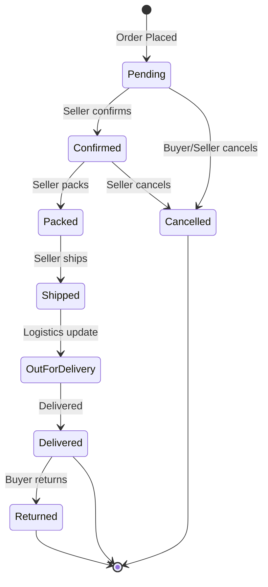

# Order & Payment System — Full Implementation Plan

## Overview

Build a complete order lifecycle with **COD** (default) + **Razorpay** (activates when key is set), a full seller order management dashboard, stock deduction on seller confirmation, and order status tracking in customer order history.

---

## Order Status Lifecycle



**Statuses**: `pending` → `confirmed` → `packed` → `shipped` → `out_for_delivery` → `delivered` | `cancelled` | `returned`

**Stock deduction**: Happens when seller moves order from `pending` → `confirmed`. Stock is restored on `cancelled` or `returned`.

---

## Phase 1: Backend — Order Routes & Status Lifecycle

### 1A. Update Order Creation (`orderRoutes.js`)

**Current**: Hardcodes `payment_method: 'Stripe'` and `is_paid: false`.

**Changes**:
- Accept `paymentMethod` from frontend (`COD` or `Razorpay`)
- For COD: set `payment_method: 'COD'`, `payment_status: 'cod_pending'`, `is_paid: false`
- For Razorpay: keep current flow (`payment_status: 'pending'`, `is_paid: false`)
- Set initial `status: 'pending'`
- Add `status_history` JSON column to track transitions with timestamps

### 1B. New: Seller Order Status Update API (`sellerRoutes.js`)

```
PATCH /api/seller/orders/:id/status
Body: { status: 'confirmed' | 'packed' | 'shipped' | 'out_for_delivery' | 'delivered' | 'cancelled', note?: string }
```

**Logic**:
- Validate status transition (e.g., can't go from `pending` → `delivered` directly)
- On `pending → confirmed`: **deduct stock** from product's `count_in_stock`
- On `cancelled` or `returned`: **restore stock**
- On `delivered` + COD: set `is_paid: true`, `payment_status: 'paid'`, `paid_at: now()`
- Append to `status_history` array
- Emit socket event `ORDER_STATUS_UPDATED` to buyer

**Allowed transitions**:
| From | Allowed Next |
|------|-------------|
| `pending` | `confirmed`, `cancelled` |
| `confirmed` | `packed`, `cancelled` |
| `packed` | `shipped` |
| `shipped` | `out_for_delivery` |
| `out_for_delivery` | `delivered` |
| `delivered` | `returned` |

### 1C. New: Get Order Detail for Seller (`sellerRoutes.js`)

```
GET /api/seller/orders/:id
```

Returns: order with items (filtered to seller's products only), shipping address, customer info, status history, payment info.

### 1D. Update Customer Order History (`orderRoutes.js`)

- Update `GET /api/orders/myorders` to include `status` field
- Update `GET /api/orders/:id` to include `status_history` and full item details

### 1E. New: Cancel Order API (`orderRoutes.js`)

```
POST /api/orders/:id/cancel
```

- Buyer can cancel only if status is `pending` or `confirmed`
- Restores stock if order was `confirmed`

---

## Phase 2: Database Schema Updates

### Orders table — add columns:

| Column | Type | Default | Purpose |
|--------|------|---------|---------|
| `status` | text | `'pending'` | Already exists, ensure consistent use |
| `status_history` | jsonb | `'[]'` | Array of `{status, timestamp, note, updatedBy}` |
| `cancelled_at` | timestamptz | null | When cancelled |
| `cancellation_reason` | text | null | Why cancelled |
| `delivered_at` | timestamptz | null | When delivered |
| `shipped_at` | timestamptz | null | When shipped |

> [!NOTE]
> Most of these fields may already exist partially. We'll add only what's missing via Supabase.

---

## Phase 3: Frontend — Checkout Payment Method Selection

### 3A. Modify `checkout/shipping/page.jsx`

**Current**: Goes straight to Razorpay popup.

**Changes**:
- Add payment method selector: **COD** (default) | **Pay Online (Razorpay)**
- COD flow: Create order → Redirect to success page (no payment popup)
- Razorpay flow: Create order → Open Razorpay popup → Verify → Redirect to success
- Razorpay button is disabled/hidden if `VITE_RAZORPAY_KEY_ID` is not set

### 3B. Update Success Page (`checkout/success/page.jsx`)

- Show order status, payment method used, and estimated delivery info
- Show "Your order will be confirmed by the seller" message for COD

---

## Phase 4: Frontend — Seller Order Management

### 4A. New: Seller Order Detail Page (`seller/orders/[id]/page.jsx`)

Full page with:
- **Order header**: Order number, date, status badge, payment method/status
- **Customer info**: Name, email
- **Shipping address**: Full address block
- **Order items**: Product image, name, quantity, price (only seller's items)
- **Action buttons**: Based on current status:

| Current Status | Available Actions |
|---------------|-------------------|
| `pending` | ✅ Confirm Order, ❌ Cancel Order |
| `confirmed` | 📦 Mark as Packed |
| `packed` | 🚚 Mark as Shipped |
| `shipped` | 🏃 Out for Delivery |
| `out_for_delivery` | ✅ Mark as Delivered |
| `delivered` | ↩️ Process Return |
| `cancelled` | (no actions) |

- **Status timeline**: Visual timeline showing all status changes with timestamps

### 4B. Update `seller/orders/page.jsx`

- Add "View Details" button on each `OrderCard` → navigates to detail page
- Add filter chips for all statuses: All, Pending, Confirmed, Packed, Shipped, Out for Delivery, Delivered, Cancelled
- Add order count badges on each filter

---

## Phase 5: Frontend — Customer Order History

### 5A. Update Order History Page (`profile/orders/page.jsx`)

- Show status badge with appropriate color per status
- Add "Cancel Order" button (visible only for `pending` / `confirmed`)
- Show payment method (COD / Razorpay) and payment status

### 5B. Update Order Detail (if exists) or Customer Order Items

- Show status timeline with timestamps
- Show estimated delivery / current status message

---

## Phase 6: Real-time Notifications

### 6A. Socket Events

| Event | Emitter | Listener | Data |
|-------|---------|----------|------|
| `NEW_ORDER` | Order creation | Seller | orderId, orderNumber, amount |
| `ORDER_STATUS_UPDATED` | Seller status update | Buyer | orderId, newStatus, message |

### 6B. Frontend Toast Notifications

- When buyer's order status changes, show toast: "Your order #ORD-XXX has been shipped!"

---

## File Change Summary

### Backend (5 files)

| Action | File | Changes |
|--------|------|---------|
| MODIFY | `routes/orderRoutes.js` | Add COD payment, cancel API, include status in responses |
| MODIFY | `routes/sellerRoutes.js` | Add `PATCH /:id/status`, `GET /:id` detail route |
| MODIFY | `routes/paymentRoutes.js` | Conditional Razorpay (skip if no key) |
| NEW | `utils/orderStatusValidation.js` | Status transition rules, stock management helpers |
| MODIFY | `server.js` | Add new socket events (if needed) |

### Frontend (8 files)

| Action | File | Changes |
|--------|------|---------|
| MODIFY | `checkout/shipping/page.jsx` | Payment method selector, COD flow |
| MODIFY | `checkout/success/page.jsx` | Show payment method, seller confirmation msg |
| NEW | `seller/orders/[id]/page.jsx` | Full seller order detail + action buttons |
| MODIFY | `seller/orders/page.jsx` | Add more filter chips, View Details link |
| MODIFY | `components/OrderCard.jsx` | Add status badge colors for all statuses |
| MODIFY | `profile/orders/page.jsx` | Add status badges, cancel button |
| NEW | `components/StatusTimeline.jsx` | Reusable status timeline component |
| NEW | `components/PaymentMethodSelector.jsx` | COD/Razorpay radio selector |

---

## Verification Plan

### Automated
- Existing vitest tests still pass
- `npm run build` succeeds

### Manual Testing
1. Place order with COD → verify it lands in seller dashboard as "pending"
2. Seller confirms → stock deducted → order moves to "confirmed"
3. Walk through full lifecycle: confirmed → packed → shipped → out_for_delivery → delivered
4. Cancel order from buyer side (pending/confirmed only)
5. Cancel order from seller side → stock restored
6. Place order with Razorpay (if key is set) → verify payment flow still works
7. Check order history shows correct status at each step
8. Verify socket notifications fire on status changes

---

## Implementation Order

1. **Backend first**: Status validation util → Order route updates → Seller routes
2. **Frontend checkout**: Payment selector → COD flow → Success page
3. **Frontend seller**: Order detail page → Action buttons → Filter updates
4. **Frontend customer**: Order history status → Cancel button
5. **Polish**: StatusTimeline component, toast notifications, socket events
